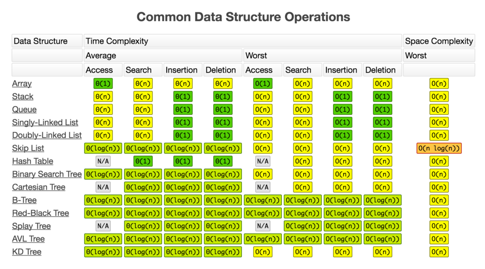

## What is worst case time complexity? 
Focus on:
- Worst case (this list is not the average)
- When n is approaching infinity 
- Difference between orders of complexity 

[More on Time Complexity](timecomplex.md)

## Sequential List (Array)
**Random Access ith item:** `O(1)` 
**Search for target data value:** `O(n)` 
**Insertion given index i:** `O(n)` 
**Deletion given index i:** `O(n)` 

## Doubly-Linked List
**Random Access ith item:** `O(n)` 
**Search for target data value:** `O(n)` 
**Insertion given index i:** `O(n)` 
**Deletion given index i:** `O(n)` 
**Insertion given pointer to the target place's node:** `O(1)` 
**Deletion given pointer to the target node:** `O(1)` 

## Singly-Linked List
**Random Access ith item:** `O(n)` 
**Search for target data value:** `O(n)` 
**Insertion given index i:** `O(n)` 
**Deletion given index i:** `O(n)` 
**Insertion given pointer to the target place's node:**` O(1)`  
**Deletion given pointer to the target node:** `O(1)` 

## Linked Stack 
**Push:** `O(1)` 
**Pop:** `O(1)` 
**Peek** `O(1)` 

## Sequential Stack 
**Push within capacity:** `O(1)` 
**Push when need to increase capacity:** `O(n)` 
**Pop within capacity:** `O(1)` 
**Pop when need to decrease capacity:** `O(n)` 
**Peek** `O(1)` 

## Linked Queue 
**Enqueue:**`O(1)` 
**Dequeue:**`O(1)` 
**Peek:**`O(1)` 

## Sequential Array Queue 
**Enqueue within capacity:** `O(1)` 
**Enqueue when need to increase capacity capacity:** `O(n)` 
**Dequeue within capacity:** `O(1)` 
**Dequeue when need to decrease capacity:** `O(n)` 
**Peek:** `O(1)` 

## Binary Search Tree
**Access:** `O(n)` 
**Search:** `O(n)` 
**Insert:** `O(n)` 
**Delete:** `O(n)` 
**Unbalanced tree:** `A tree of size n can grow in a straight line in the worst case scenario, where time complexity is O(n) as height = n-1` 

## AVL Tree 
**Access:** `O(log(n))` 
**Search:** `O(log(n))` 
**Insert:** `O(log(n))` 
**Delete:** `O(log(n))` 

## Space Complexities 
Defn: Auxillary space is the extra space or temporary space used by an algorithm. 
`O(n) for most, O(1) for bubble, selection ahd heap sort algorithms, and O(log(n) for quick sort algorithms.`

## Sorting Algorithms
**Bubble Sort:** `O(n^2)`  
**Selection Sort:** `O(n^2)`  
**Heap Sort:** `O(n(log(n)))`  
**Merge Sort:** `O(n(log(n)))`  
**Quick Sort:** `O(n^2)`  

## Hashing 
**Search:** `O(n)`
**Insertion:** `O(n)`
**Deletion:** `O(n)` 

=======

