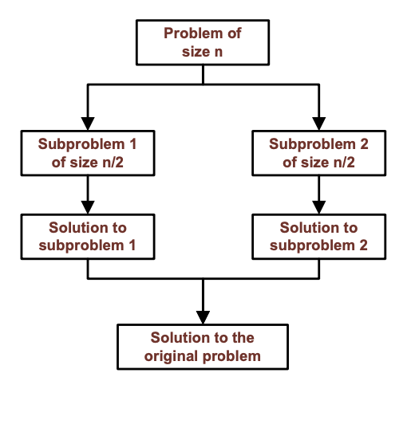

# Sorting
**The Sorting Problem**
- Given an unordered collection of data elements, arrange them into an ordered collection that is sorted in 
    - Ascending/increasing order, or
    - Descending/decreasing order

## Bubble Sort Algorithm
- Use a flag to store if any swap is done in the last iteration
- Use a temp variable for swapping
- First loop, leep repeating until no swap was made in the last iteration
- Second loop, iterate from the first element to the last unsorted element (first iteration starts from `0` to `n-2`)
    - Each time, if `element[i]` is larger than `element[i+1]`, swap them and mark swapped = true
- at the end of each loop, set the last element as sorted

### Bubble Sort Demo
```cpp
#include <iostream>
using namespace std;

void BubbleSort(int A[], int size);
void BubbleSort(int A[], int size){
    ///////////////////////////////////////////

    //use a flag to store if any swap is done in the last iteration
    bool swapped;

    //use a temp variable for swapping
    int temp;

    //first loop, keep repeating until no swap was made in the last iteration.
    do{
        //set swapped to false
        swapped = false;

        //second loop, iterate from the first element to the last unsorted element (first iteration starts from 0 to size - 2)
        //each time, if element[i] is larger than element[i + 1], swap them, and mark the swapped = true
        for(int i = 0; i < size - 1; i++){
            if (A[i] > A[i+1]) {
                temp = A[i];
                A[i] = A[i+1];
                A[i+1] = temp;
                swapped = true;
            }
        }
        //at the end of each first loop, set the last element as sorted.
        size--;
    }while (swapped);

    ///////////////////////////////////////////
}


int main()
{
    bool long_test = false;

    if(!long_test){
        int array1[7] = {7, 1, 3, 5, 4, 6, 2 };

        BubbleSort(array1, 7);

        //print sorted array
        for (int i = 0; i < 7; i++ ){
            cout<< array1[i] <<", " ;
        }
        cout<<endl;
    }
    else{
        
    }


    return 0;
}
```

## Selection Sort Algorithm
- First loop, repeat `n-1 times` (i=0 to n-2, because the nth time has only one element)
- Second loop, find the minimal value from the remaining unsorted elements
- Swap that minimum element with the **first of the unsorted elements**
- Mark that element as sorted

### Selection Sort Demo Code
```cpp
#include <iostream>
using namespace std;

void SelectionSort(int A[], int size);
void SelectionSort(int A[], int size){
    ///////////////////////////////////////////

    int min_index;
    int temp;
    //First loop, repeat n - 1 times (from 0 to n - 2)
    for (int i = 0; i < size - 1; i++){ // i < size  also works, but waste some computation.
        //Second loop, find the minimal value from the remaining unsorted elements.
        min_index = i;
        for(int j = i + 1; j < size; j++){ // j = i also works, but waste some computation.
            if(A[j] < A[min_index]) min_index = j;
        }
        //Swap that minimum element with the first of the unsorted elements.
        if(min_index != i) { // save some computation by first checking if it is self
            temp = A[min_index];
            A[min_index] = A[i];
            A[i] = temp;
        }
    }

    ///////////////////////////////////////////
}


int main() {
    bool long_test = false;

    if (!long_test) {
        int array1[7] = {7, 1, 3, 5, 4, 6, 2};

        SelectionSort(array1, 7);

        //print sorted array
        for (int i = 0; i < 7; i++) {
            cout << array1[i] << ", ";
        }
        cout << endl;
    }

}
```

## Heap Sort (ex. ascending order)
1. Transform an array into a max-heap (build max heap, or heapify)
2. Dequeue one by one to get a sorted order

**Transform an array into a Max-Heap**
A simple method
- Insert items from the array into a max-heap one by one

- Not a very good method, worst case time complexity: `O(n*log(n))`
    - Auxilarly/extra space: `O(n)`

A better method: **Heapify Algorithm**
- Treat the array as a complete binary tree
- Iteratively visit the nodes from the branch node with the largest index value, reverse breadth first order, back to the root node
    - When visiting each node, call **ReHeapDown** function with the node index as input parameter

Worst case time complexity: `O(n)`
Space complexity: `O(1`)`
## Heap Sort Algorithm
**Overall time complexity:** `O(n log(n))`

1. Treat the array as a complete binary tree
2. Transform the array into a max-heap `O(n)` (**heapify**)
    - Iteratively visit the nodes from the branch node with the largest index value, reverse breadth first order, back to the root node.
    - When visiting each node, call `ReHeapDown` function with the node index as input parameter
3. Dequeue one by one to get a sorted order `O(n log(n))`
    - Each dequeue reduce the array by 1 (1 free space)
    - Put the output value from the dequeue at the free space

### HeapSort Demo Code
```cpp
#include <iostream>
using namespace std;

void HeapSort(int A[], int size);
void ReheapDown(int elements[], int size, int index);
int Dequeue(int elements[], int size);


void ReheapDown(int elements[], int size, int index){  // with the array as an input, and with root index = 0
    ////////////////////////////////////////////////////////////////////
    //Or until reaching a leaf node (the bottom)
    if (2 * index + 2 > size) return;

    //	If there is any child of the new root,
    int chooseChild;

    // only one child, it must be the left child
    if (2 * index + 2 == size) chooseChild = 2 * index + 1;
    else { // two children, find the larger child. If same, e.g., prefer left.
        int leftChild = 2 * index + 1;
        int rightChild = 2 * index + 2;
        if( elements[leftChild] >= elements[rightChild] ) chooseChild = leftChild;
        else chooseChild = rightChild;
    }


    if(elements[chooseChild] >= elements[index]){
        //If the child has a key larger than the node or same as the node, swap the node with that child.

        int temp = elements[chooseChild];
        elements[chooseChild] = elements[index];
        elements[index] = temp;

        ReheapDown(elements, size, chooseChild); //Continue re-heap downwards
    }

    //until that child is smaller.
    ////////////////////////////////////////////////////////////////////

}


int Dequeue(int elements[], int size){ //modified version for heap sort
    if(size == 0)  return -999;

    int temp = elements[0];

    // Copy last item into root
    elements[0] = elements[size-1];

    //size--;  size will be managed outside of this function.

    // Reheap the tree, size is reduced by 1
    ReheapDown(elements, size - 1, 0);

    return temp;
}


void HeapSort(int A[], int size){
    ///////////////////////////////////////////

    //Transform an array into a max-heap (heapify).
    //Iteratively visit the nodes from the branch node with the largest index value, reverse breath first order, back to the root node.
    //the last leaf node index is size - 1,
    //its parent is  floor( (size - 1 - 1)/2 ) = int  (size - 2)/2
    for(int i = (size - 2)/2  ; i >= 0; i--){
        //When visiting each node, call ReHeapDown function with the node index as input parameter.
        ReheapDown( A, size, i );
    }

    //Dequeue one by one to get a sorted order. store the sorted order in the same array. larger number in the end.
    for(int i = 0; i < size; i++){
        A[ size - 1 - i ] = Dequeue (A, size - i);
    }

    ///////////////////////////////////////////
}


int main() {
    bool long_test = false;

    if (!long_test) {
        int array1[7] = {7, 1, 3, 5, 4, 6, 2};

        HeapSort(array1, 7);

        //print sorted array
        for (int i = 0; i < 7; i++) {
            cout << array1[i] << ", ";
        }
        cout << endl;
    }
}
```
## Merge Sort (Divide and Merge)
**Divide and Conquer Algorithms**
- Divide the problem instance into two or smaller instances, and solve the smaller instances recursively
- Derive a solution to the original problem instance by combining the smaller recursive solutions


**Input**: an array, int indexLeft, int indexRight
    - Ex. `A[7]`, indexLeft = 0, indexRight = 6
    - Size info is included in the indices
**Output**: void return type, because array is passing by reference. The input array is sorted

1. Input check. If any `index < 0`, or `indexLeft >= indexRight`, do nothing. And return.
2. Find `indexMiddle` to divide the array into to parts
3. Recursively call `MergeSort` to sort the first half and the second half of the array
4. Merge the first half and the second half back into a sorted order, from small to large values

### Merge Sort Demo
```cpp
#include <iostream>
using namespace std;

void MergeSort(int A[], int indexLeft, int indexRight);

void MergeSort(int A[], int indexLeft, int indexRight){
    ///////////////////////////////////////////
    //Input check. If any index < 0, or indexLeft >= indexRight, do nothing.
    if(indexLeft < 0 ||  indexRight < 0) return;
    if(indexLeft >= indexRight) return;

//	cout<< "MergeSort with " << indexLeft << ", " << indexRight << endl;

    //Find indexMiddle to divide the array into two parts.
    int indexMiddle = indexLeft + ( indexRight -  indexLeft ) / 2 ;  //e.g., 0, 1, 2, middle = 1;  0, 1, 2, 3, middle = 1

    //Recursively call MergeSort to sort the first half and the second half of the array.
    MergeSort(A, indexLeft, indexMiddle);
    MergeSort(A, indexMiddle + 1, indexRight);

    //Merge the first half and the second half back into a sorted order, from small to large values.
    int tempA [ indexRight - indexLeft + 1  ]; // to store the merged array
    int i = indexLeft, j = indexMiddle + 1; //i for left half array, j for right half array
    int k = 0; //k for temp array
    while(true){

        if( A[i] <= A[j] ) {
            tempA[k] = A[i];
            k++;
            i++;
        }
        else{
            tempA[k] = A[j];
            k++;
            j++;
        }


        if( i > indexMiddle ){
            //left half is done, place the remaining right half
            for( ; j <=  indexRight; j++, k++ ){
                tempA[k] = A[j];
            }
            break;
        }
        if( j > indexRight ){
            //right half is done, place the remaining left half
            for( ; i <=  indexMiddle; i++, k++ ){
                tempA[k] = A[i];
            }
            break;
        }
    }

    //copy tempA back into A
    for ( k = 0; k < indexRight - indexLeft + 1   ; k++ ){
        A[indexLeft + k] = tempA[k];
    }

//	for ( k = 0; k < indexRight - indexLeft + 1   ; k++ ){
//		cout<<  tempA[k] << ", ";
//	}
//	cout<<endl;

    ///////////////////////////////////////////
}


int main() {
    bool long_test = false;

    if (!long_test) {
        int array1[7] = {7, 1, 3, 5, 4, 6, 2};

        MergeSort(array1, 0, 6);

        //print sorted array
        for (int i = 0; i < 7; i++) {
            cout << array1[i] << ", ";
        }
        cout << endl;
    }
}
```
## Merge Sort vs Heap Sort
- In heap sort, first, building the heap needs to compare and swap many items, then each dequeue also needs to compare and swap many items
- In merge sort, worst case time complexity is still `O(n log n)` but it uses fewer comparisons and swaps
- However, the trade-off is that merge sort requires more memory space

## Quick Sort
**Ideas**
- In merge sort, we divided the array by index
- In quick sort, we divided the array by the data value
    - `indexPivot`
    - `A[indexPivot]`
- Move smaller `A[i]` values to the left of pivot point, larger `A[i]` values to the right of pivot point
Then
    - Recursively, sort the values on the left side of pivot 
    - Recursively, sort the values on the right side of pivot

**How to pick a pivot point**
- Pick one with smallest index
- Pick one with largest index
- Pick a random one
- Pick one with the median data value

Ideally, we want the two sub arrays after division have similar size. 

### Quick Sort Algorthm (Version 1)
- **Input**: an array, int indexLeft, int indexRight
- Input check. If any `index < 0`,or `indexLeft >= indexRight`, do nothing. And return.
- Pick the pivot point 
- Divide the remaining array into two parts. Move items smaller than pivot value to the left, move items larger than the pivot value to thr right side
- Recursively, quick sort the values on the left of the pivot
- Recursively, quick sort the values on the right of pivot

### Quick Sort Algorithm (Partition)
- Use two indices, `x` and `y`, to iterate through the array. `x` from left to right, `y` from right to left
- Start by setting `x` to the first element (`indexLeft +1`), and `y` to the last element (`indexRight`)

Repeat the following:
- Move `x` one element at a time to right until it reaches an element whos value is greater than the pivot or until it reaches `indexRight + 1` (so all the items with `index < x` will be no larger than pivot)
- If `x` reaches or passes `y`, break the loop
- If not break, move `y` one element at a time to left until it reaches an element whos value is smaller than the pivot or until it reaches `x`
- If `y` reaches `x`, break the loop
- If not break, swap `x` and `y` values, and continue the loop

- Move the pivot point to the proper location

### Quick Sort Demo
```cpp
#include <iostream>
using namespace std;

void QuickSort(int A[], int indexLeft, int indexRight);

void QuickSort(int A[], int indexLeft, int indexRight){
    ///////////////////////////////////////////

//	cout<< "QuickSort with " << indexLeft << ", " << indexRight << endl;

    //Input check. If any index < 0, or indexLeft >= indexRight, do nothing.
    if(indexLeft < 0 || indexRight < 0) return;
    if(indexLeft >= indexRight) return;

    //Pick the pivot point (e.g., the left most item).
    int indexPivot = indexLeft;

    // Divide the remaining array in two parts. Move items smaller than pivot value to the left,
    // move items larger than pivot value to the right side. (Partition.)

    //Use two indices, x and y, to iterate through the array
    int x, y;
    //Start by setting x to the first element, and y to the last element
    x = indexLeft + 1;
    y = indexRight;

    int temp;
    //repeat the following
    while(true){
        //Move x one element at a time to right until it reaches an element whose value is greater than the pivot or until it reaches indexRight + 1
        // so all the items index < x will be no larger than pivot.
        while ( A[x] <= A[indexPivot] && x < indexRight + 1) x++;

        //If x reaches or passes y, break the loop.
        if(x >= y) break;

        //If not break, move y one element at a time to left until it reaches an element whose value is smaller than the pivot or until it reaches x
        while ( A[y] >= A[indexPivot] && y > x  ) y--;

        //If y reaches x, break the loop.
        if(x == y) break;

        //If not break, swap x and y values, and continue the loop
        temp = A[x];
        A[x] = A[y];
        A[y] = temp;
    }

    //Move the pivot point to the proper location. (i.e., x - 1)
    if(indexPivot != x - 1){
        temp = A[indexPivot];
        A[indexPivot] = A[x-1];
        A[x-1] = temp;

        indexPivot = x - 1;
    }

//	for (int k = indexLeft; k <= indexRight    ; k++ ){
//		cout<<  A[k] << ", ";
//	}
//	cout<<endl;

    //Recursively, quick sort the values on the left of pivot.
    QuickSort(A, indexLeft, indexPivot - 1);

    //Recursively, quick sort the values on the right of pivot.
    QuickSort(A, indexPivot + 1, indexRight);


    ///////////////////////////////////////////
}


int main() {
    bool long_test = false;

    if (!long_test) {
        int array1[7] = {7, 1, 3, 5, 4, 6, 2};

        QuickSort(array1, 0, 6);

        //print sorted array
        for (int i = 0; i < 7; i++) {
            cout << array1[i] << ", ";
        }
        cout << endl;
    }
}
```

### Quick Sort Space Complexity Optimization 
Previous implementation ^^ uses two recursive calls 

Instead...
- Use an loop iteration to replace one of the recursive call
- Before the recursive call, we can check which part (left or right) is smaller. - We will always sort the smaller part with the recursive call. Leave the other part for the next iteration in the loop. 
- The result is that the max number of nested recursion will be in the order of `log2n`. In each recursion, space needed is constant. Therefore, the extra space needed is `O(log n)`

### Quick Sort 2 Demo Code
```cpp
#include <iostream>
using namespace std;

void QuickSort(int A[], int indexLeft, int indexRight);

void QuickSort(int A[], int indexLeft, int indexRight){
    ///////////////////////////////////////////

    while(true){


        //	cout<< "QuickSort with " << indexLeft << ", " << indexRight << endl;

        //Input check. If any index < 0, or indexLeft >= indexRight, do nothing.
        if(indexLeft < 0 || indexRight < 0) return;
        if(indexLeft >= indexRight) return;

        //Pick the pivot point (e.g., the left most item).
        int indexPivot = indexLeft;

        // Divide the remaining array in two parts. Move items smaller than pivot value to the left, move items larger than pivot value to the right side. (Partition.)

        //Use two indices, x and y, to iterate through the array
        int x, y;
        //Start by setting x to the first element, and y to the last element
        x = indexLeft + 1;
        y = indexRight;

        int temp;
        //repeat the following
        while(true){
            //Move x one element at a time to right until it reaches an element whose value is greater than the pivot or until it reaches indexRight + 1
            // so all the items index < x will be no larger than pivot.
            while ( A[x] <= A[indexPivot] && x < indexRight + 1) x++;

            //If x reaches or passes y, break the loop.
            if(x >= y) break;

            //If not break, move y one element at a time to left until it reaches an element whose value is smaller than the pivot or until it reaches x
            while ( A[y] >= A[indexPivot] && y > x  ) y--;

            //If y reaches x, break the loop.
            if(x == y) break;

            //If not break, swap x and y values, and continue the loop
            temp = A[x];
            A[x] = A[y];
            A[y] = temp;
        }

        //Move the pivot point to the proper location. (i.e., x - 1)
        if(indexPivot != x - 1){
            temp = A[indexPivot];
            A[indexPivot] = A[x-1];
            A[x-1] = temp;

            indexPivot = x - 1;
        }

//	for (int k = indexLeft; k <= indexRight    ; k++ ){
//		cout<<  A[k] << ", ";
//	}
//	cout<<endl;


        //if the left partition is smaller, recursively, quick sort the values on the left of pivot.
        // leave the right part for the next iteration.
        if( indexPivot - indexLeft <  indexRight - indexPivot )  {
            QuickSort(A, indexLeft, indexPivot - 1);
            indexLeft = indexPivot + 1;
        }
        else{
            //otherwise, recursively, quick sort the values on the right of pivot.
            //leave the left part for the next iteration.
            QuickSort(A, indexPivot + 1, indexRight);
            indexRight = indexPivot - 1;
        }

    }
    ///////////////////////////////////////////
}


int main() {
    bool long_test = false;

    if (!long_test) {
        int array1[7] = {7, 1, 3, 5, 4, 6, 2};

        QuickSort(array1, 0, 6);

        //print sorted array
        for (int i = 0; i < 7; i++) {
            cout << array1[i] << ", ";
        }
        cout << endl;
    }
}
```
## In summary, for array sorting we learned:
**If space is limited**: use `Heap Sort`

If space is enough and only care about **average performance**: `Quick Sort` (on average faster than Merge Sort, but could be worst in some cases)
- If need guaranteed `O (n log n)` time complexity, `Merge Sort`(but will need more space)
