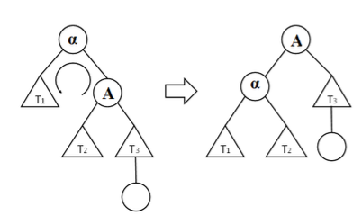
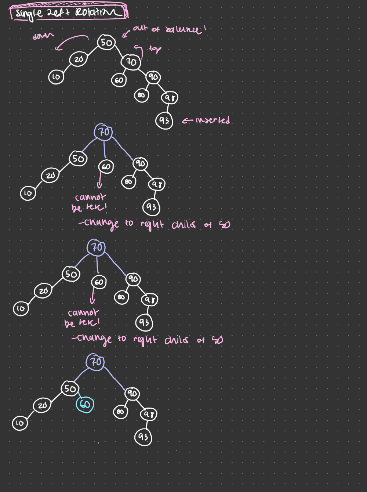
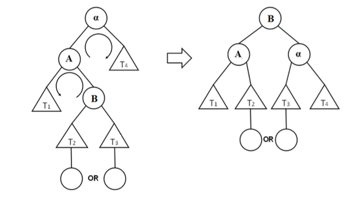

## AVIL Trees
- Special BST that is kept **height balanced**
- The absolute difference in heights between the left and right subtrees is **less than or equal to 1** 
    - this property holds for every node!

## AVL Insert
1. Use the regular BST Insert operation, insert new Node N
2. Find out if any of N's ancestors is unbalanced. 
    - If not, jobt done and return. 
    - If so, find out the pointer to the unbalanced ancestor that is closest to N
3. Then re-balance the AVL tree using one of the four rotations, depending on the cases
    1. Single Right
    2. Single Left
    3. Left Right
    4. Right-Left

## Single Right Rotation
- Insert to left child's left subtree

## Single Right Rotation - Algorithm
- Input is alpha (the pointer to the unbalanced ancestor that is closest to the new node)
- A is alpha's left
- alpha's left = A's right
- A's right = alpha
- Let alpha's parent take A as the new child
    - If alpha was the root of the whole tree make A to be the new root

## Single Left Rotation
- Insert to right child's right subtree

### Algorithm
- Input is alpha
- A is alpha's right
- alpha's right = A's left
- A's left = alpha
- Let alpha's parent take A as the new child
    - If alpha was the root of the whole tree, make A to be the new root

## Left-Right Rotation
- Insert ot left child's right subtree

### Algorithm
- Input is alpha
- A is alpha's left
- B is A's right
- Call single left rotation with input (A)
- Call single right rotation with input(alpha)

## Right-Left Rotation
- Insert to right child's left subtree

