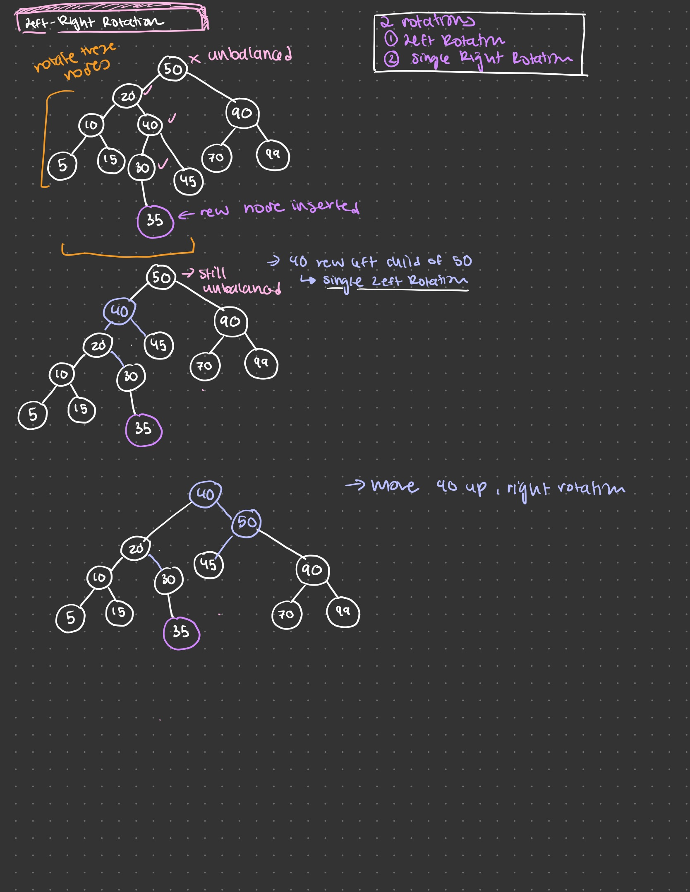

## AVIL Trees
- Special BST that is kept **height balanced**
- The absolute difference in heights between the left and right subtrees is **less than or equal to 1** 
    - this property holds for every node!

## AVL Insert
1. Use the regular BST Insert operation, insert new Node N
2. Find out if any of N's ancestors is unbalanced. 
    - If not, jobt done and return. 
    - If so, find out the pointer to the unbalanced ancestor that is closest to N
3. Then re-balance the AVL tree using one of the four rotations, depending on the cases
    1. Single Right
    2. Single Left
    3. Left Right
    4. Right-Left

## Single Right Rotation
- Insert to left child's left subtree


## Single Right Rotation - Algorithm
- Input is alpha (the pointer to the unbalanced ancestor that is closest to the new node)
- A is alpha's left
- alpha's left = A's right
- A's right = alpha
- Let alpha's parent take A as the new child
    - If alpha was the root of the whole tree make A to be the new root


## Single Left Rotation
- Insert to right child's right subtree


### Algorithm
- Input is alpha
- A is alpha's right
- alpha's right = A's left
- A's left = alpha
- Let alpha's parent take A as the new child
    - If alpha was the root of the whole tree, make A to be the new root


## Left-Right Rotation
- Insert ot left child's right subtree


### Algorithm
- Input is alpha
- A is alpha's left
- B is A's right
- Call single left rotation with input (A)
- Call single right rotation with input(alpha)




## Right-Left Rotation
- Insert to right child's left subtree

### Algorithm 
- Input is alpha
- A is alpha's right
- B is A's left
- Call single right rotation with input(A)
- Call single left rotation with input (alpha)


## Demo Code - AVL Tree insert
```cpp
#include<iostream>
#include<string>
#include <algorithm>    // std::max
using namespace std;

//declaration
class AVLTreeNode {
public:    //set as public for simplicity
    string value; //InfoClass info; //holds the data info
    int key;  // the key used for searching
    AVLTreeNode *leftChild;  //points to left child
    AVLTreeNode *rightChild; //points to right child

    AVLTreeNode(int val, string str);
};

void PreOrderPrint(AVLTreeNode* T);  // recursive version.
void InOrderPrint(AVLTreeNode* T);	// recursive version.
void PostOrderPrint(AVLTreeNode* T);	// recursive version.

string Search (AVLTreeNode* T, int K); //return the node with key K, same as BST

bool Insert(AVLTreeNode **pT, AVLTreeNode *N);  //same as BST
bool Delete(AVLTreeNode **pT, int K);   //same as BST
int Height(AVLTreeNode *T);  //same as BST

bool AVL_Insert(AVLTreeNode **pT, AVLTreeNode *N);
bool AVL_Delete(AVLTreeNode **pT, int K);

void SingleRightRotation (AVLTreeNode **pT, AVLTreeNode *alpha);
void SingleLeftRotation (AVLTreeNode **pT, AVLTreeNode *alpha);
void LeftRightRotation (AVLTreeNode **pT, AVLTreeNode *alpha);
void RightLeftRotation (AVLTreeNode **pT, AVLTreeNode *alpha);


// implementation
AVLTreeNode::AVLTreeNode(int val, string str) : key(val), value(str), leftChild(NULL),  rightChild(NULL)  {
}

void PreOrderPrint(AVLTreeNode* T){  // recursive version.
    if (T == NULL) return;
    cout<<(T->key)<< "(" <<(T->value)   <<"), "; // print root data or other processing
    PreOrderPrint(T->leftChild);
    PreOrderPrint(T->rightChild);
}
void InOrderPrint(AVLTreeNode* T){	// recursive version.
    if (T == NULL) return;
    InOrderPrint(T->leftChild);
    cout<<(T->key)<< "(" <<(T->value)   <<"), "; // print root data or other processing
    InOrderPrint(T->rightChild);
}
void PostOrderPrint(AVLTreeNode* T){	// recursive version.
    if (T == NULL) return;
    PostOrderPrint(T->leftChild);
    PostOrderPrint(T->rightChild);
    cout<<(T->key)<< "(" <<(T->value)   <<"), "; // print root data or other processing
}


string Search (AVLTreeNode* T, int K){

    // iterative
    /////////////////////////////
    AVLTreeNode* current_node = T;
    while (current_node != NULL) {
        if (current_node->key == K) return current_node->value;
        else if (K < current_node->key)
            current_node = current_node->leftChild;
        else current_node = current_node->rightChild;
    }
    return "Search failed. No such key.";
    /////////////////////////////
}


bool Insert(AVLTreeNode **pT, AVLTreeNode *N){
/////////////////////////////////
    AVLTreeNode *T;
    T = *pT;

    // recursive version
    if(*pT == NULL) { //when input *pT is NULL, this is the root = NULL case, nothing in the tree.
        *pT = N; //If T is NULL, insert the node as the root of T, then return true and terminate
        return true;
    }
    //Compare the desired key value KN with the key value of the current node KT
    if (N->key == T->key) {
        return false;  //If KN == KT, then return false and terminate
    }
    else if (N->key < T->key) {
        if(T->leftChild == NULL) {
            T->leftChild = N;
            return true;
        }
        else return Insert( &T->leftChild,  N ); //If KN < KT, then continue insertion in the left subtree of T
    }
    else {
        if( T->rightChild == NULL) {
            T->rightChild = N;
            return true;
        }
        else return Insert( &T->rightChild,  N ); 	//If KN > KT, then continue insertion in the right subtree of T
    }


    //may need to do size++ when this function is included in a class of BST

/////////////////////////////////
}


bool Delete(AVLTreeNode **pT, int K){
/////////////////////////////////
    AVLTreeNode *T;
    T = *pT;

    //Find D in T (similar to Search)
    AVLTreeNode* current_node = T;
    AVLTreeNode* parent_node = NULL;
    bool isLeftChild = false;
    bool found = false;
    while (current_node != NULL) {
        if (current_node->key == K) {
            found = true;
            break;
        }
        else if (K < current_node->key){
            parent_node = current_node;
            current_node = current_node->leftChild;
            isLeftChild = true;
        }
        else {
            parent_node = current_node;
            current_node = current_node->rightChild;
            isLeftChild = false;
        }
    }

    //If D cannot be found, return false
    if(found == false) return false;

    //If D is found, then do the following:
    //If D is a leaf node in T (no child), remove it, then return true and terminate
    if(current_node->leftChild == NULL && current_node->rightChild == NULL ){
        //a special case it that if current_node is the root node
        if(current_node == T){
            delete *pT;
            *pT = NULL;
            return true;
        }

        //if it is not the root node.
        delete current_node;
        if(isLeftChild) parent_node->leftChild = NULL;
        else parent_node->rightChild = NULL;
        return true;
    }

    //If D has only one child node, cut D from the tree, and link D's parent directly to D's only child.
    if(current_node->leftChild != NULL && current_node->rightChild == NULL){ // left child is not empty, right child is empty
        if(isLeftChild) parent_node->leftChild = current_node->leftChild;
        else parent_node->rightChild = current_node->leftChild;
        delete current_node;
        return true;
    }
    else if (current_node->leftChild == NULL && current_node->rightChild != NULL) { // right child is not empty, left child is empty
        if(isLeftChild) parent_node->leftChild = current_node->rightChild;
        else parent_node->rightChild = current_node->rightChild;
        delete current_node;
        return true;
    }


    //If D has two child nodes, swap the values with the predecessor (or successor), delete the predecessor (or successor) respectively, and then return true and terminate
    if(current_node->leftChild != NULL && current_node->rightChild != NULL ){
        //Successor is the smallest value in the right subtree
        //find successor
        AVLTreeNode *successor = current_node->rightChild;
        isLeftChild = false;  // at the first step, successor is the right child of its parent.

        AVLTreeNode *successor_parent = current_node;

        while(successor->leftChild != NULL){
            successor_parent = successor;
            successor = successor->leftChild;
            isLeftChild = true;
        }

        current_node->key = successor->key;
        current_node->value = successor->value;


        //here, in fact, should also check if successor is a leaf node or a branch node with only one child.
        // successor must have leftchild empty; because if it is not empty, should have used the leftchild as successor

        //if it is the leaf node
        if(successor->rightChild == NULL ){
            if(isLeftChild)	successor_parent->leftChild = NULL;
            else 			successor_parent->rightChild = NULL;
        }
        else {  //if it is the branch node. its right child is not empty
            if(isLeftChild)	successor_parent->leftChild = successor->rightChild;
            else 			successor_parent->rightChild = successor->rightChild;

        }
        delete successor;
        return true;
    }


    //may need to do size-- when this function is included in a class

/////////////////////////////////
}


int Height(AVLTreeNode *T){
    if(T == NULL) return -1;
    else if (T->leftChild == NULL && T->rightChild == NULL) return 0;
    else {
        return 1 + max(Height(T->leftChild), Height(T->rightChild) );
    }
}


bool AVL_Insert(AVLTreeNode **pT, AVLTreeNode *N){
/////////////////////////////////	/////////////////////////////////
    //Use the regular BST Insert operation, insert new Node N.

    bool result = Insert(pT, N);

    if(result == false) return false;

    //Find out if any of N’s ancestors is unbalanced. If not, job done and return.
    //If so, find out the pointer to the unbalanced ancestor that is closest to N.

    AVLTreeNode *root;
    root = *pT;

    //special case, if N is inserted at the root node, nothing unbalanced, just return.
    if(root->key == N->key) return true;

    AVLTreeNode *temp;
    temp = root;
    AVLTreeNode *temp_parent;
    AVLTreeNode *alpha = NULL;

    do{
        temp_parent = temp;
        if(N->key > temp->key) temp = temp->rightChild;
        else if (N->key < temp->key) temp =  temp->leftChild;
        //now, check if temp_parent is unbalanced.
        int leftHeight = Height(temp_parent->leftChild);
        int rightHeight = Height(temp_parent->rightChild);
        if( abs(leftHeight - rightHeight) >= 2 ) alpha = temp_parent;

    } while ( temp->key != N->key  );

    if(!alpha) return true;

    //Then re-balance the AVL tree using one of the four rotations, depending on the cases.
    if     ( N->key < alpha->key && N->key < alpha->leftChild->key  ) SingleRightRotation (pT, alpha);
    else if (N->key > alpha->key && N->key > alpha->rightChild->key ) SingleLeftRotation(pT, alpha);
    else if ( N->key < alpha->key && N->key > alpha->leftChild->key ) LeftRightRotation(pT, alpha);
    else if (N->key > alpha->key && N->key < alpha->rightChild->key ) RightLeftRotation(pT, alpha);

    return true;

/////////////////////////////////	/////////////////////////////////
}


void SingleRightRotation (AVLTreeNode **pT, AVLTreeNode *alpha){
////////////////////////////////////

    //Input is alpha
    //A is alpha’s left
    AVLTreeNode *A = alpha->leftChild;

    //alpha’s left = A’s right
    alpha->leftChild = A->rightChild;

    //A’s right = alpha
    A->rightChild = alpha;

    //If alpha was the root of the whole tree, make A to be the new root.
    if (*pT == alpha) {
        *pT = A;
    }
    else {
        //Let alpha’s parent take A as the new child.

        //find 	alpha’s parent
        AVLTreeNode *temp = *pT;
        AVLTreeNode **parentPointerToAlpha = NULL;
        do{
            if(alpha->key > temp->key)  {
                parentPointerToAlpha = &temp->rightChild;
                temp = temp->rightChild;
            }
            else if (alpha->key < temp->key) {
                parentPointerToAlpha = &temp->leftChild;
                temp = temp->leftChild;
            }
        }
        while (temp->key != alpha->key);

        *parentPointerToAlpha = A;
    }
////////////////////////////////////
}


void SingleLeftRotation (AVLTreeNode **pT, AVLTreeNode *alpha){
////////////////////////////////////

    //Input is alpha
    //A is alpha’s right
    AVLTreeNode *A = alpha->rightChild;

    //alpha’s right = A’s left
    alpha->rightChild = A->leftChild;

    //A’s left = alpha
    A->leftChild = alpha;


    //If alpha was the root of the whole tree, make A to be the new root.
    if (*pT == alpha) {
        *pT = A;
    }
    else {
        //Let alpha’s parent take A as the new child.

        //find 	alpha’s parent
        AVLTreeNode *temp = *pT;
        AVLTreeNode **parentPointerToAlpha = NULL;
        do{
            if(alpha->key > temp->key)  {
                parentPointerToAlpha = &temp->rightChild;
                temp = temp->rightChild;
            }
            else if (alpha->key < temp->key) {
                parentPointerToAlpha = &temp->leftChild;
                temp = temp->leftChild;
            }
        }
        while (temp->key != alpha->key);

        *parentPointerToAlpha = A;
    }
////////////////////////////////////
}


void LeftRightRotation (AVLTreeNode **pT, AVLTreeNode *alpha){
////////////////////////////////////
    //Input is alpha

    //A is alpha’s left
    AVLTreeNode *A = alpha->leftChild;

    //B is A’s right


    //Call single left rotation with input (A)
    SingleLeftRotation(pT, A);

    //Call single right rotation with input (alpha)
    SingleRightRotation(pT, alpha);
////////////////////////////////////

}


void RightLeftRotation (AVLTreeNode **pT, AVLTreeNode *alpha){
////////////////////////////////////

    //Input is alpha

    //A is alpha’s right
    AVLTreeNode *A = alpha->rightChild;

    //B is A’s left


    //Call single right rotation with input (A)
    SingleRightRotation(pT, A);

    //Call single left rotation with input (alpha)
    SingleLeftRotation(pT, alpha);
////////////////////////////////////

}


//main
int main(){

    AVLTreeNode *root = NULL;

/*		//Single Right Rotation

    cout<<"(5, \"\"): " << AVL_Insert(&root, new AVLTreeNode(5, "")  ) <<endl;
    PreOrderPrint(root);
    cout<<endl;		cout<<endl;

    cout<<"(2, \"\"): " << AVL_Insert(&root, new AVLTreeNode(2, "")  ) <<endl;
    PreOrderPrint(root);
    cout <<endl;		cout<<endl;

    cout<<"(1, \"\"): " << AVL_Insert(&root, new AVLTreeNode(1, "")  ) <<endl;
    PreOrderPrint(root);
    cout <<endl;		cout<<endl;
*/


/*		//Single Left Rotation

    cout<<"(1, \"\"): " << AVL_Insert(&root, new AVLTreeNode(1, "")  ) <<endl;
    PreOrderPrint(root);
    cout<<endl;		cout<<endl;

    cout<<"(2, \"\"): " << AVL_Insert(&root, new AVLTreeNode(2, "")  ) <<endl;
    PreOrderPrint(root);
    cout <<endl;		cout<<endl;

    cout<<"(5, \"\"): " << AVL_Insert(&root, new AVLTreeNode(5, "")  ) <<endl;
    PreOrderPrint(root);
    cout <<endl;		cout<<endl;
*/

/*		//Left-Right Rotation

    cout<<"(5, \"\"): " << AVL_Insert(&root, new AVLTreeNode(5, "")  ) <<endl;
    PreOrderPrint(root);
    cout<<endl;		cout<<endl;

    cout<<"(2, \"\"): " << AVL_Insert(&root, new AVLTreeNode(2, "")  ) <<endl;
    PreOrderPrint(root);
    cout <<endl;		cout<<endl;

    cout<<"(3, \"\"): " << AVL_Insert(&root, new AVLTreeNode(3, "")  ) <<endl;
    PreOrderPrint(root);
    cout <<endl;		cout<<endl;
*/

/*		//Left-Right Rotation

    cout<<"(3, \"\"): " << AVL_Insert(&root, new AVLTreeNode(3, "")  ) <<endl;
    PreOrderPrint(root);
    cout<<endl;		cout<<endl;

    cout<<"(6, \"\"): " << AVL_Insert(&root, new AVLTreeNode(6, "")  ) <<endl;
    PreOrderPrint(root);
    cout <<endl;		cout<<endl;

    cout<<"(5, \"\"): " << AVL_Insert(&root, new AVLTreeNode(5, "")  ) <<endl;
    PreOrderPrint(root);
    cout <<endl;		cout<<endl;
*/


///*   //AVL Tree Construction Example
    cout<<"(3, \"\"): " << AVL_Insert(&root, new AVLTreeNode(3, "")  ) <<endl;
    PreOrderPrint(root);
    cout<<endl;		cout<<endl;

    cout<<"(6, \"\"): " << AVL_Insert(&root, new AVLTreeNode(6, "")  ) <<endl;
    PreOrderPrint(root);
    cout <<endl;		cout<<endl;

    cout<<"(5, \"\"): " << AVL_Insert(&root, new AVLTreeNode(5, "")  ) <<endl;
    PreOrderPrint(root);
    cout <<endl;		cout<<endl;

    cout<<"(1, \"\"): " << AVL_Insert(&root, new AVLTreeNode(1, "")  ) <<endl;
    PreOrderPrint(root);
    cout<<endl;		cout<<endl;

    cout<<"(2, \"\"): " << AVL_Insert(&root, new AVLTreeNode(2, "")  ) <<endl;
    PreOrderPrint(root);
    cout <<endl;		cout<<endl;

    cout<<"(10, \"\"): " << AVL_Insert(&root, new AVLTreeNode(10, "")  ) <<endl;
    PreOrderPrint(root);
    cout <<endl;		cout<<endl;

    cout<<"(15, \"\"): " << AVL_Insert(&root, new AVLTreeNode(15, "")  ) <<endl;
    PreOrderPrint(root);
    cout<<endl;		cout<<endl;

    cout<<"(13, \"\"): " << AVL_Insert(&root, new AVLTreeNode(13, "")  ) <<endl;
    PreOrderPrint(root);
    cout <<endl;		cout<<endl;

    cout<<"(12, \"\"): " << AVL_Insert(&root, new AVLTreeNode(12, "")  ) <<endl;
    PreOrderPrint(root);
    cout <<endl;		cout<<endl;

    cout << Height(root) << endl;
    cout << Height(root->leftChild) << endl;
    cout << Height(root->rightChild) << endl;

//*/
    return 0;
}
```

## AVL Delete
1. Use the regular BST Delete operation to delete Node D
2. From D's parent (if swapped, use the actually deleted node's parent), travels up to the root of the whole tree. If any node is unbalanced, re-balance it, and repeat until the root. 

When a node is unbalanced, call it alpha. Find which subtree of alpha is higher, then the subtree's root is A.

Then find which subtree of A is higher. Depending on the four cases, similar to insert, re-balnce the AVL tree using one of the four rotations.
- **Single Right** (if A is left child; A's left is higher, or left right same)
- **Single Left** (if A is right child; A's right is higher, or left right same)
- **Left-Right** (if A is left child; A's right is higher)
- **Right-Left** (if A is right child; A's left is higher)

```cpp
bool Delete(BSTNode **pT, key of BSTNode D): 
```
- Find D in T (similar to Search)
- If D cannot be found, return false 
- If D is found, then do the following:
    1. If D is a leaf node is T (**no child**), remove it, then return true and terminate
    2. If D has **only one** child node, cut D from the tree, and link D's parent directly to D's only child.
    3. *If D has **two** child nodes, replace the values with the predecessor (or successor) respectively, and then return true and terminate
        - Predecessor is the maximum value in the left subtree
        - Successor is the smallest value in the right subtree 


