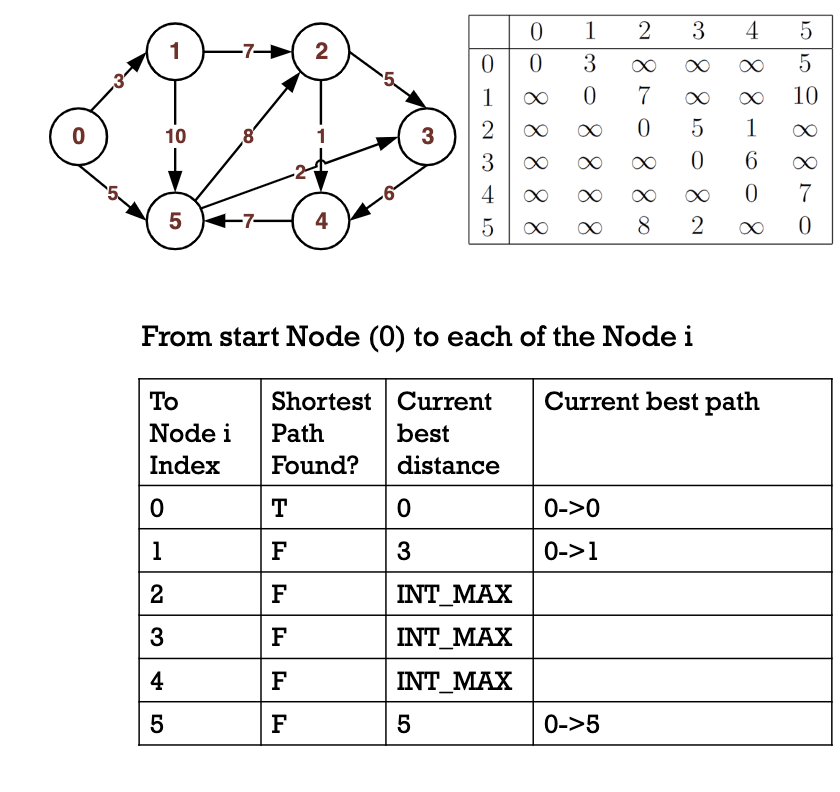

# Djikstra's Algorithm 
### Properties 
Weight of edge should be positive 
Distance to a node itself is defined as 0 
### Input 
Graph (such as an adjacency matrix) 
A start Node 
An end Node 
### Output 
The shortest path from start Node to end Node 

**The values of the nodes are stored in the form of three *arrays***
1. Whether we have found the shortest distance from startNode to each node in the graph.
2. The current known shortest distance from startNode to each node. 
3. The current known shortest path from startNode to each node in the format 

Essentially, we need to look to our matrix so we can continue to fill out this table.  

### Steps
1. Initialize the three array values using information about the start Node from its adjacent nodes. 
2. Among the nodes whose shortest distance is yet to be found, find the one that is connected to the startNode and call it tempNode. 
3. If not found, no one is connected to startNode and thus there is no path from startNode to endNode. 
4. If found, then this tempNode's shortest path is found. 
5. If tempNode is the endNode, terminate. 
6. Check if the old best paths from startNode to each pending nodes can be improved by going from startNode to this tempNode first and then from tempNode to the pending nodes. If so, improve old routes. 

**Demo Code**
'#include <iostream> //cout
#include <limits> // numeric_limits<int>::max()   // 2147483647
#include <string> //string, to_string (c++11)

using namespace std;

const int INT_MAX = numeric_limits<int>::max();

const int SIZE = 6;	// total number of nodes

void dijkstra( int adjMatrix[SIZE][SIZE], int startNode, int endNode );

void dijkstra( int adjMatrix[SIZE][SIZE], int startNode, int endNode ) {
	//input validity check, e.g., trivial case, from a node to itself dist = 0.
	if(startNode == endNode) {
		cout<< "From Node " << startNode<< " to itself is zero distance." << endl;
		return;
	}'

	bool shortestDistFound[SIZE];  //whether we have found the shortest distance from startNode to each node in the graph. initially all false
	int shortestDist[SIZE]; 		//the current known shortest distance from startNode to each node.
	string shortestPath[SIZE];		//the current known shortest path from startNode to each node in the format e.g., "0->1->2"

	//initialize, check the adjacent nodes of startNode
	for( int i = 0; i < SIZE; i++ ) {
		shortestDist[i] = adjMatrix[startNode][i];
		if (shortestDist[i] < INT_MAX ) shortestPath[i] = to_string (startNode) + "->" + to_string(i);
		if (i == startNode) shortestDistFound[i] = true;
		else shortestDistFound[i] = false;
	}

	while( true ){
		//among the shortestDist-not-yet-found node (i.e., pending nodes), find the one connected to startNode and closest to startNode.
		int tempNodeIndex = -1;
		int tempDist = INT_MAX;
		for( int i = 0; i < SIZE; i++ ) {
			if( (shortestDistFound[i] == false)  &&  (shortestDist[i] < tempDist) ) {
				tempDist = shortestDist[i];
				tempNodeIndex = i;
			}
		}

		//if not found, i.e., no one is connected to startNode (tempNodeIndex is still -1), then no path from startNode to endNode, terminate
		if(tempNodeIndex == -1){
			cout<< "No path from Node " << startNode << " to Node "<< endNode << endl;
			return;
		}

		//if found, then this tempNode's shortest path is found, because going to another node and then come back could not be better than this.
		shortestDistFound[tempNodeIndex] = true;

		//if this is the endNode, job done. return.
		if(tempNodeIndex == endNode){
			cout <<"Found shortest path from "<<startNode<< " to " << endNode << ". Path: " << shortestPath[endNode] << ", total distance: " << shortestDist[endNode] << endl;
			return;
		}

		//check if the old best path from startNode to each pending nodes can be improved
		//by going from startNode to this tempNode first and then from tempNode to the pending nodes.
		//if so, improve the old pathes.
		for( int i = 0; i < SIZE; i++ ) {
			if ( !shortestDistFound[i] ) {
				if(  adjMatrix[tempNodeIndex][i] != INT_MAX
				&&   tempDist + adjMatrix[tempNodeIndex][i] < shortestDist[i]  ) { //can improve
					shortestDist[i] = tempDist + adjMatrix[tempNodeIndex][i];
					shortestPath[i] = shortestPath[tempNodeIndex] + "->" + to_string(i);
				}
			}
		}
	}
}'

'int main()
{
	// adjacency matrix representation
    int m[6][6]  =  { {0, 3, INT_MAX, INT_MAX, INT_MAX, 5},
                   	{INT_MAX, 0, 7, INT_MAX, INT_MAX, 10},
                   	{INT_MAX, INT_MAX, 0, 5, 1, INT_MAX},
                   	{INT_MAX, INT_MAX, INT_MAX, 0, 6, INT_MAX},
                   	{INT_MAX, INT_MAX, INT_MAX, INT_MAX, 0, 7},
                   	{INT_MAX, INT_MAX, 8, 2, INT_MAX, 0} 		 };

	dijkstra(m, 0, 0);
	dijkstra(m, 0, 1);
	dijkstra(m, 0, 2);
	dijkstra(m, 0, 3);
	dijkstra(m, 0, 4);
	dijkstra(m, 0, 5);
	dijkstra(m, 1, 0);
	dijkstra(m, 3, 0);

	// cout << INT_MAX << endl;   // 2147483647

    return 0;
}'
