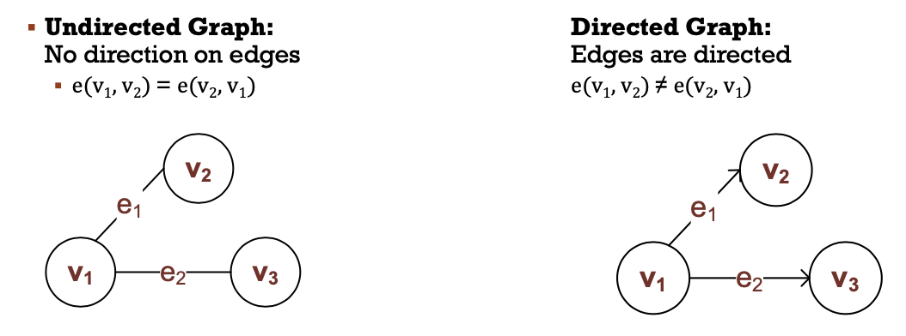
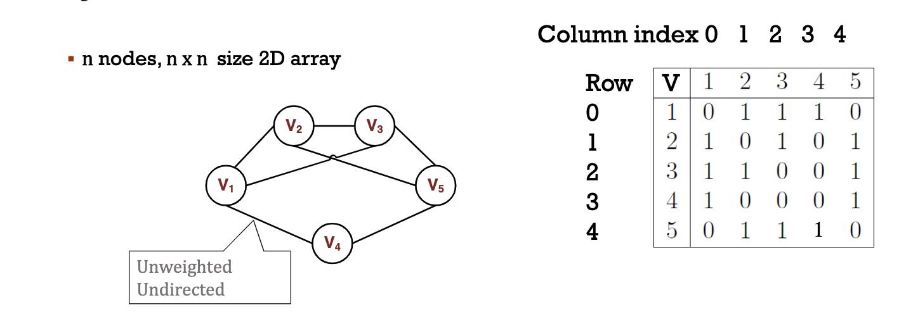

# Graph
- A collection of nodes (verticies) connected by edges
- A node represents an entity
- An edge represents a pair-wise relationship between two nodes

## Formal Definition of a Graph
- A graph G can be defined as `G = (V, E)` where `V` is the set of node (verticies) and `E` is the set of edges
- An edge `e(vi, vj)` represents an edge from `vi` to `vj`

- One way following (directed)
- Two-way reciprocal/two-way road (undirected)

## Degree of a Node
- In an undirected graph, **degree** of a node is the number of distinct edges where the node is an end point
- In a directed graph, **in-degree** of a node is the number of distinct edges where the node is the end point
- In a directed graph, the **out-degree** of a node is the number of distinct edges where the node is the starting point

**Labeled graph:** A graph where each node has a unique symbolic label assosciafted with it

**Weighted graph**: A graph where each edge has a numerical value assosciated with it

## Adjacency
- Two nodes are adjacent if there exists and edge that connects them
- The adjacency set of a node x, whch is denoted as `Vx`, is the set of all nodes that are adjacent to x

## Graph Implementation
1. Using sequential representation (arrays): as a matrix
2. Using linked representation: as a series of linked lists 

## Graph Basic Operations
### Search (IsReachable)
*Ex. Is Node 7 reachable from Node 2?*
1. Start from a starting node
2. Following the edges, when reaching the target node, return true
3. If finish all the reachable nodes without seeing the target, return false.

## Adjacency Matrix
**Key Points**
- n nodes, n*n size 2D array 
- uses storage size of O(n^2) 
- list storage may be smaller when the graph is not very dense (not too many nodes are connected)
- supports faster query to check if two nodes are adjacent compared to a list
- sequential array = adjacency matrix and preferred when most nodes are connected, and query of adjacency is frequent 
- linked node = adjacency list and preferred when few nodes are connected, and query of adjacency is not frequent 

**Unweighted Graphs**
If a vertice is connected to another edge, we have 1 (true) in the matrix, else, 0 (false) 
For undirected graphs, M[i][j] is always the same as M[j][i] in the 2D array 

**Weighted Graphs** 
For weighted edges, we store either the weight value (instead of 1 as we did for unweighted) or infinite (instead of 0 as we did for weighted)
For directed graphs, M[j][i] is always the same as M[i][j] in the 2D array 

### Graph Search 
1. Start from a starting node 
2. Following the edges, when reaching the target node, return true 
3. If finished all the reachable nodes without seeing the target, return false 

### Graph Traversal
*Ex. What are the nodes that are reachable?*
1. Start form a starting node
2. Following the edges, visiting each reachable node
3. End until have visited each node that can be reached frmo the starting node

Essentially, search is a special kind of traversal that has an early termination condition 
*Refer to Week 10 Meeting 1 Lecture Notes for in-depth walkthrough* 

*General Process for Traversal* 
1. At some node *Nx*, access its adjacency set and insert unvisited nodes into some container C. 
2. Remove a node from C, mark as visited, and insert all unvisited notes of the adjacency set into C once again. 
3. Repeat until the container is empty. 

## Graph Traversal and Container Selection
**Breadth-First-Search (BFS)**
- Use Queue ADT (FIFO principle) as the container

**Depth-First-Search**
- Use Stack ADT (LIFO principle) as the container
