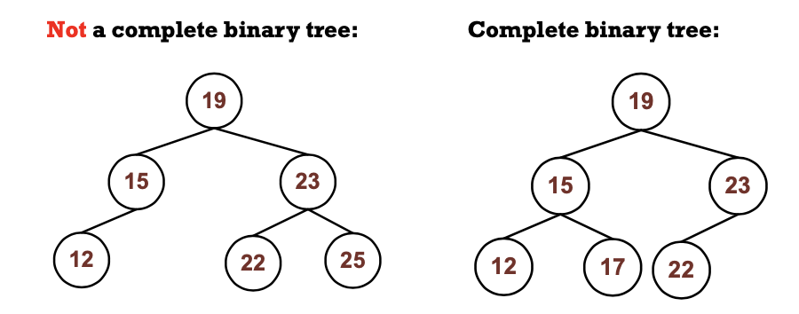
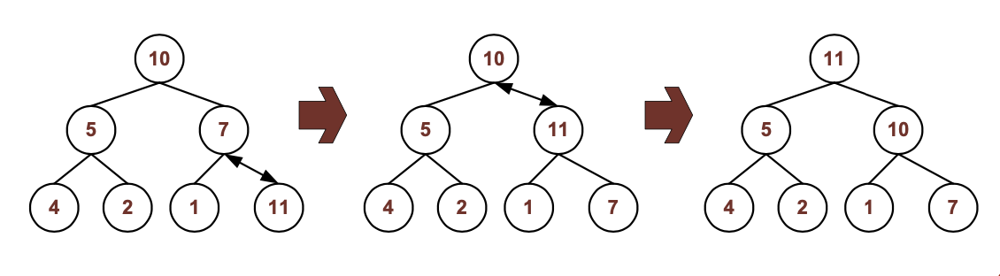
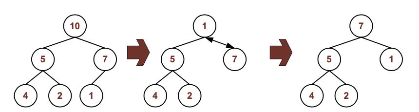

# Heap
**Priority Queue**: An element with high priority is served before an element with low priority

## Linear list structure
- top for next dequeue

Peek: `O(1)`
Enqueue: `O(n)`
Dequeue: `O(1)`

## Branched Structure
Peek: `O(1)`
Enqueue: `O(log n)`
Dequeue: `O(log n)`

## Binary Max Heap
- Binary tree with keys stored in its nodes
- Parent key value >= children key value
- Therefore the root node has the max value
- A heap needs to be a **complete binary tree**

## Complete Binary Tree
- A binary tree that is completely filled at all levels with the exception of the bottom-most level
- And at the bottom-most level, all leaf nodes are as far left as possible

## Heaps ADT Operations
### Insert (enqueue)
- Insert a node into the heap
1. Insert node as bottom-right-most leaf in the tree
2. If the parent has a smaller value than the node, swap with the parent
3. Continue this **re-heap upwards**
    - Until the parent has a higher (or same value than the node) or
    - Unitl reaching the root node (no more parent)

## Remove (dequeue)
- Remove a node from the heap **always remove the root node**
1. Save the root node for return
2. Replace the root node with the bottom-right-most leaf node in the tree
3. If there is any child of the new root, find the larger child. If same, prefer left
4. If the child has a key larger than the node, swap the node with that child
5. Continue **re-heap** downwards
    - Until that child is smaller, or same
    - Or until reaching a leaf node (the bottom)
6. Return the old node

