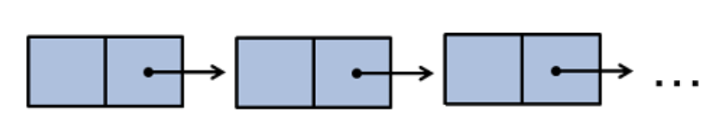

# Linked List

## Array vs Linked Lists
**Array** 
- To store a series of data (ex. multiple integers) we may use an array of int. 
- However, the size of the array needs to specified. The entire memory space of that size is allocated, even if not all the space is used to store meaningful data. 


**Linked List**
- Can increase and decrease the occupied memory space in a more flexible way


## Train Analogy
**Freight car**: Node

**Contents in the car**: Data item

**Link to the next car**: Pointer to the next node

**Add a car**: Insert a node

**Remove a car**: Delete a node



## Node
**Node**
- A data structure that contains both **data** and a **pointer** to hte next node in the chain/sequence. It is often defined as a struct for easier access (public members)
``` cpp
struct Node {
    int data;
    Node* next; 
};
```


## Linked List
- An ordered chain/sequence of nodes, where the pointer of each node points to the next node in the list
- Nodes can be added to the chain to expand the storage space of the list
- Similarly, nodes can be removed when not needed

## Basic Operations
- Initialize a lsit with one node 
- Add a node to the end of the list
- Add a node at the front of the list
- Access the data stored in a node
- Remove a node

### Demo 
``` cpp
/* Basic operations for a Linked List of nodes*/
#include <iostream>
using namespace std;

struct Node {
    //public members by default in struct
    int data;
    Node *next;
    Node() : data(0), next(NULL) {}; // constructor with no input argument
    Node(int x) : data(x), next(NULL) {}; // constructor with one int argument
};

int main () {
    //Initialize a list with one node.
    Node *headNode = new Node(2);

    //Add a node to the end of the list
    headNode ->next = new Node(3);

    //Add a node at the front of the list.
//    headNode = new Node(1) - we cannot do this! or else we lose track
        Node *temp = new Node(1);
        temp ->next = headNode;
        headNode = temp;
        temp = nullptr;

    //Print data in all three nodes.
    cout << headNode->data << ", ";
    cout << headNode->next->data <<", ";
    cout << headNode->next->next->data <<endl;
    cout << endl;

    //Remove a node.
    //remove first node.
    temp = headNode;
    headNode = headNode->next; // after removing the first node, we need the head pointer (headNode) to point to the new head of the list

    //the new head's address is stored in (old) headNode->next
    delete temp;
    temp = NULL; // removing the first node

    //Print data in all two nodes.
    cout<< headNode->data <<", ";
    cout<< headNode->next->data <<endl;
    cout<<endl;


    //Remove a node.
    //remove last node.
    temp = headNode;
    Node *temp2 = NULL;
    while(temp->next != NULL){
        temp2 = temp;
        temp = temp->next;
    }
    delete temp;
    temp = NULL;
    temp2->next = NULL;
    //Print data in the only one node.
    cout<< headNode->data <<endl;
    cout<<endl;
    return 0;
}

```


## Linked List Class
- The previous example is not object-oriented programming (all procedures in the main function)
- It is better to put each method in its own function and group these methods in a class (encapsulation)

### Demo Code
``` cpp
/* Basic Linked List class*/
#include <iostream>
using namespace std;

struct Node {     //in C++, a struct is a class that has all members public by default; otherwise same as class. often used to represent data members only, without method members.
	int data;   //every member is public by default in struct
	Node *next;
	Node() : data(0), next(NULL) {}; //it may have constructors too.
	Node(int x) : data(x), next(NULL) {}; 
};

//declaration
class LinkedListInt {
private:	
	Node *head;
	
public:	
	LinkedListInt(); //constructor
	void insertFront (Node* newNode);
	void removeTail ();
	void print() const;  // const function cannot change any value
};

//implementation
LinkedListInt::LinkedListInt() : head(NULL){
}

void LinkedListInt::insertFront (Node* newNode){
	if (newNode == NULL) {		//check input
		cout<<"Warning! insertFront has newNode == NULL." <<endl;
		return;
	}		
	
	if (head == NULL) { 	//special case: list is empty
		head = newNode;
	} else { 					// general case: non-empty list
		newNode->next = head;
		head = newNode;		
	}
}

void LinkedListInt::removeTail (){
	if (head == NULL) { // check for NULL value
		cout<<"Warning! head == NULL. Nothing to remove." <<endl;
		return; 
	}
	
	if(head->next == NULL){  //speical case: list with only one node
		delete head;
		head = NULL;
	}
	else{	// list with two or more nodes
		Node* secondLast = head;		
		while(secondLast->next->next != NULL){
			secondLast = secondLast->next;
		}
		delete secondLast->next;
		secondLast->next = NULL;
	}
}

void LinkedListInt::print () const {
	if (head == NULL) {
		cout<<"Warning! head == NULL. Nothing to print." <<endl;		
		return; // check for NULL values
	}

	//list not empty
	cout << "("; // start
	Node* temp;
	temp = head;	
	while (temp != NULL) { // iterate until NULL
		cout << "[" << temp->data << "]"; // print node value
		temp = temp->next;
		if (temp != NULL) cout << "->"; // print -> symbol between nodes, if there is a next one.			
	}	
	cout << ")\n"; // end

}

int main () {	
	LinkedListInt *test = new LinkedListInt();
	test->print();

	test->insertFront(new Node(1));
	test->print();	

	test->insertFront(new Node(2));
	test->print();
	
	test->insertFront(new Node(3));	
	test->print();	
	
	test->removeTail();
	test->print();
	
	test->removeTail();
	test->print();

	test->removeTail();
	test->print();
	


	Node *temp1 = new Node(4);
	test->insertFront(temp1);
	test->print();	

	Node *temp2 = new Node(5);	
	test->insertFront(temp2);
	test->print();

	delete test;
	
	cout<< temp1->data << endl;
	cout<< temp2->data << endl;	

	
		
	return 0;
}
```


## Shallow Copy
**Shallow Copy**
- Copies only the member variables
- Default for the assignment and copy constructors

**Deep Copy**
- When pointers and dynamic memory are involved
- Also copy the data pointed ot by the pointers
- Write your own copy constructor and assigment overload in this case


## Copy Constructor
- Treat as a read-only value
- Ptovided to make copies of an existing object
- A default copy constructor is provided (shallow copy)

Synxtax
```cpp
myClass(const MyClass & object); 
```
- Reference (alternative name) of an object
- Const sets it as **read-only**

### Demo 
``` cpp
/* Basic Linked List class*/
#include <iostream>
using namespace std;

struct Node {
    int data;
    Node *next;
    Node() : data(0), next(NULL) {};
    Node(int x) : data(x), next(NULL) {};
};

//declaration
class LinkedListInt {
public:
    Node *head;
public:
    LinkedListInt(); //constructor

    //what if there is no manually overloaded deep copy constructor?

	LinkedListInt(const LinkedListInt &list); //copy constructor, & list is a reference to the original object

    ~LinkedListInt(); //destructor

    void insertFront (Node* newNode);
    void removeTail ();
    void print() const;  // const function cannot change any value
};

//implementation
LinkedListInt::LinkedListInt() : head(NULL){
}


LinkedListInt::LinkedListInt(const LinkedListInt &list){ //copy constructor
	cout<< "copy constructor called" << endl;

	if(list.head == NULL){
		head = NULL;
	}
	else{ //if not empty
		head = new Node (list.head->data); // use the data stored in the original node

		Node *temp1, *temp2;
		temp1 = list.head;
		temp2 = head;
		while(temp1->next != NULL){
		    //going through every single node
			temp2->next = new Node(  temp1->next->data   );
			temp1 = temp1->next;
			temp2 = temp2->next;
		}
	}

}


LinkedListInt::~LinkedListInt() {    //destructor
    Node *current,*temp;
    current = head;
    temp = head;
    while(current != NULL) {
        current = current->next;
        delete temp;
        temp = current;
    }
}

void LinkedListInt::insertFront (Node* newNode){
    if (newNode == NULL) {		//check input
        cout<<"Warning! insertFront has newNode == NULL." <<endl;
        return;
    }

    if (head == NULL) { 	//special case: list is empty
        head = newNode;
    } else { 					// general case: non-empty list
        newNode->next = head;
        head = newNode;
    }
}

void LinkedListInt::removeTail (){
    if (head == NULL) { // check for NULL value
        cout<<"Warning! head == NULL. Nothing to remove." <<endl;
        return;
    }

    if(head->next == NULL){  //speical case: list with only one node
        delete head;
        head = NULL;
    }
    else{	// list with two or more nodes
        Node* secondLast = head;
        while(secondLast->next->next != NULL){
            secondLast = secondLast->next;
        }
        delete secondLast->next;
        secondLast->next = NULL;
    }
}

void LinkedListInt::print () const {
    if (head == NULL) {
        cout<<"Warning! head == NULL. Nothing to print." <<endl;
        return; // check for NULL values
    }

    //list not empty
    cout << "("; // start
    Node* temp;
    temp = head;
    while (temp != NULL) { // iterate until NULL
        cout << "[" << temp->data << "]"; // print node value
        temp = temp->next;
        if (temp != NULL) cout << "->"; // print -> symbol between nodes, if there is a next one.
    }
    cout << ")\n"; // end

}

int main () {
    //shallow copy provided by the default constructor
    LinkedListInt test = LinkedListInt(); //will call the constructor
    //inserting 3 nodes here
    test.insertFront(new Node(1));
    test.insertFront(new Node(2));
    test.insertFront(new Node(3));
    test.print();

    LinkedListInt copy = LinkedListInt( test ); 	//or // LinkedListInt copy = test;
    // not a new linked list, it's just a copy of the original linked list
    test.removeTail();
    test.print();
    copy.print();

    cout<< test.head << endl; //address is stored at the original head
    cout<< copy.head << endl;

    //do we expect these addresses to be the same?? - yes!!
    //they are the same bc in shallow copy they're in the same address

    return 0;
}
```

When do you need copy constructor - when you have an old object, and you want to have a new object and the values are all the same. 
- Do something with the new object without changing the old object

Difference between list.head and this head
```cpp
this->head - //refers to the new object
```

## What is the difference between dynamic arrays and linked list data structures?
**Dynamic Array**: data structure implemented based on the basic array.
- Insert operation can still happen when the array is full. 
- It can be done by creating a larger array and copy all the data from the old one into the new one 

Recal: Dynamic Array
``` cpp
int * foo;
foo = new int [5];
```

**Basic Array**: 
- In a basic array (ex. ``int a[10];``) its size is fixed and initalized at the creation of the array. 
- The number of elements cannot exceed the size/capacity. 

**Aspect** | **Dynamic Array** | **Linked List** | **Which one is better?**
--- | --- | --- | ----
Time to access the ``ith`` element | Very fast thanks to the index feature. | Slow due to the lack of index. Must iterate through the list. | Dynamic Array 
Time to ``insert``/``delete`` at the beginning | Slow. Must shift all existing elements. | Fast. Change a few pointers. | Linked list
Time to ``insert``/``delete`` at the end | Fast when within capacity. Slow when the size of the array must be expanded. | Fast, given that a pointer to the tail is implemented. | Linked list
Extra memory storage needed to store the data elements (storage overhead) | Little | More, due to the pointers in each node. | Dynamic array

- In general, if elements need to be frequently added or removed from the list, the size of the list can change and you don't need to access random elements very often, it is better to use linked list.
- If the size of the list is relatively stable, and you need to frequently access random elements, it is better to use dynamic array

##  Removing, Replacing, and Inserting in Linked lists

### Demo Code
```cpp
/*some basic operations for the class of linked list*/
#include <iostream>
using namespace std;
typedef int DataType;

struct Node {
    DataType data;
    Node *next;
    Node(int x) : data(x), next(nullptr) {};//overloaded constructor
};

class LinkedList{
    Node *head = nullptr; //this variable is private
    //size, omitted

public:
    void insert(DataType value, int position);
    void replace(int position, DataType value);
    void remove(int position); //find the node at this position and remove it from the linked list
    void print(); // print all elements in the list
    //overload destructor, omitted
    //overload copy constructor, omitted
    //overload assignment operator =, omitted

};

void LinkedList::insert(DataType value, int position) {
    //step 1. check position validity, compare with 0 and size,
    //if not valid, quit, report error, or force into a valid value
    //omitted in this demo, assuming it is valid

    //step 2. create new node
    Node *newNode = new Node(value); //* new node is a pointer (left-side), right-side is the node

    //step 3. if special case, when position = 0
    //insert as the new head
    //3.1 when head == nullptr, or size == 0
    if(position == 0){
        if(head == nullptr){
            head = newNode;
            return;
        }
        else{ //3.2 when size > 0
            newNode->next = head;
            head = newNode;
            return;
        }
    }

    //step 4. when position > 0, size > 0
    //iterate through the list to find the position
    //with an additional pointer for the address of the previous node
    Node *previous = head; //need to know address of previous node
    Node *current = head->next;
    int i = 1;
    while (i < position) {
        previous = current;
        current = current->next;
        if (current == nullptr) {
            break; // reach the end
        }
        i++;
    }

    //step 5. insert the node between previous and current
    newNode->next = current;
    previous->next = newNode;

}

void LinkedList::replace(int position, DataType value) {
    //step 1. check position validity, compare with 0 and size,
    //if not valid, quit, report error, or force into a valid value
    //omitted in this demo, assuming it is valid

    //step 2. iterate a pointer to the position
    Node *current = head;
    int i = 0;
    while (i < position) {
        current = current->next;
        if (current == nullptr) {
            break; // reach the end
        }
        i++;
    }

    //step 3. replace the value
    current->data = value;

}

void LinkedList::remove(int position) {
    //step 1. check position validity, compare with 0 and size,
    //if not valid, quit, report error, or force into a valid value
    //omitted in this demo, assuming it is valid

    //step 2. special case, if position == 0, remove head
    if(position == 0){
        Node *temp = head;
        head = head->next;
        delete temp;
        temp = nullptr;
        return;
    }

    //step 3. iterate a pointer to the position
    //and another pointer for the node address previous of it
    Node *previous = head;
    Node *current = head->next;
    int i = 1;
    while (i < position) {
        previous = current;
        current = current->next;
        if (current == nullptr) {
            break; // reach the end
        }
        i++;
    }

    //step 4. remove the node and properly link the remaining nodes.
    previous->next = current->next;
    delete current;
    current = nullptr;
}

void LinkedList::print() {
    if (head == nullptr) {
        return;
    }
    //print all nodes
    Node *temp = head;
    while (temp != nullptr) {
        cout<< temp->data << "->";
        temp = temp->next;
    }
    cout<< endl;
}


int main () {
    LinkedList myList; //name of the linked list, memory is statically allocated
    myList.insert(2, 0); //will call the insert function
    myList.insert(4, 1);
    myList.insert(1, 0);
    myList.insert(5, 3);
    myList.insert(3, 2);
    myList.print();

    myList.replace(2, 33);
    myList.print();

    myList.remove(3);
    myList.remove(0);
    myList.print();

    return 0;
}
```

***Deleting**

```cpp
 delete current;  // deallocate memory pointed in the place by the pointer, actual pointer is not deleted

current = nullptr; //deletes the pointer/sets it to null